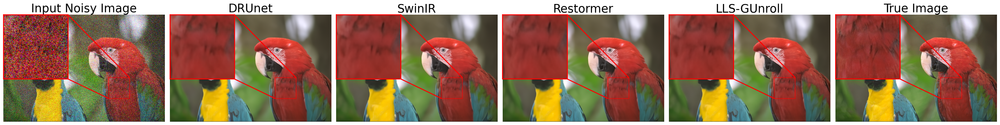
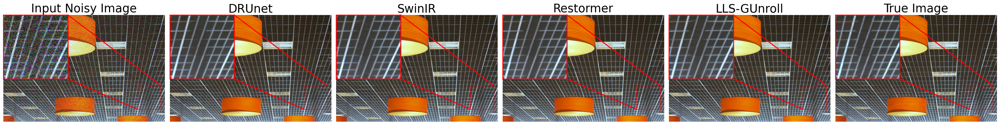
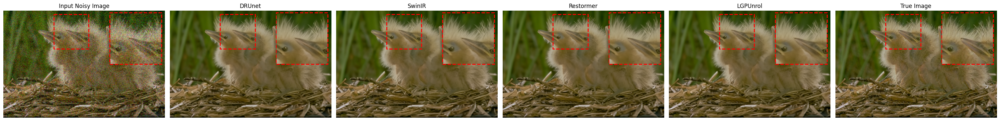
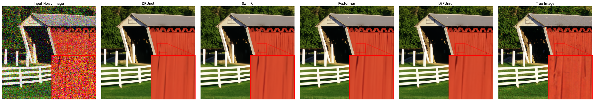

# ImageRestoration-Development-Template
Developing Image restoration learning pipeline for Lightweight Interpretable Deep Learning models.

# Devlog - 17 Sep 2025
Successfully submitted a preprint version outlining the mathematic aspect of developed models and demonstrate early results compared with various state-of-the-art deep learning models

